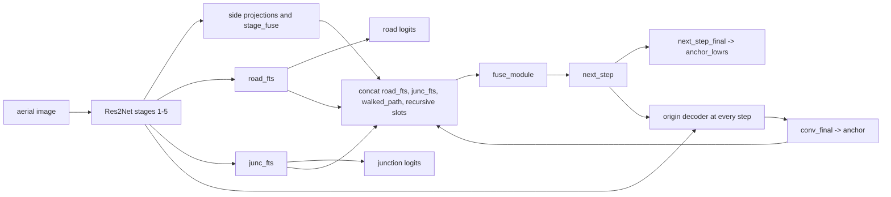
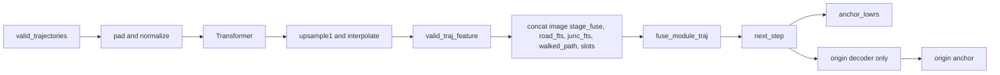
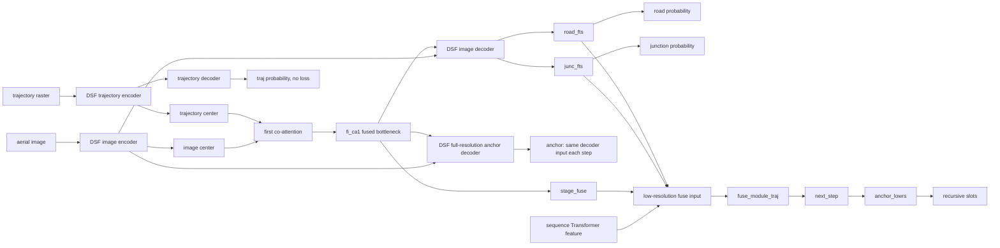

# Seg-Raster Stage S0 model and data flow

## Scope and notation

This document describes the production code at source commit
`13488c768d147b37632ffeefe4b62cb3e94b36ec`. It does not propose or implement
`raster_seg_only`, and it does not alter the trajectory-sequence branch.

`road_fts` and `junc_fts` are feature tensors. `road_final` and `junc_final`
are prediction tensors. A registered module is shown as executed only when the
runtime hook inventory reached it.

## Origin image-only path

In `model/model.py:494-502`, the origin decoder consumes `next_step` at every
time step. Its decoded feature is pooled back into the recursive slots at
`model/model.py:519-542`. Synthetic train and eval runs therefore produced
different `anchor` and `anchor_lowrs` channels for 0-vs-1, 0-vs-2, and
0-vs-3. See `artifacts/stage_s0_anchor_step_audit.json`.

## Current sequence path

The only real trajectory modes are `none` and `legacy_current`
(`utils/trajectory_mode.py:10-12`). In `legacy_current`, the dataset requests
both raster and sequence fields (`utils/OSMDataset.py:213-220`) and RPNet
registers DSF as well as Transformer modules. With `TRAIN.MODEL=origin`, the
raster and DSF are not executed; the Transformer feature is passed directly to
`fuse_module_traj` (`model/model.py:425-461, 483-486`). Thus there is no clean
checked-in sequence-only parameter surface: sequence-only causal use still
constructs a large, dormant DSF surface.

## Current DSF/raster path

Only `co_att_first` is called (`model/DSFNet.py:251-254`). The trajectory
decoder and `traj_final` execute (`model/DSFNet.py:233-238`), but no training
loss consumes `traj_road` (`train.py:328-352`). Runtime hooks found all
20,547,200 trajectory-decoder parameters and the 74,689 trajectory-head
parameters forward-reached but `grad=None`.

The DSF full-resolution anchor decoder at `model/model.py:503-512` receives
`fi_ca1` plus DSF image skip features and never receives `next_step`. The same
decoder inputs are reused for every loop iteration. Consequently every channel
of full-resolution DSF `anchor` is exactly equal in both train and eval, while
`anchor_lowrs` changes because `fuse_module_traj` does consume the recursive
slots.

## Causal questions answered

| Question | Verified answer |
|---|---|
| Does raster affect anchor only through road/junction features? | No. `fi_ca1` is a raster-image fused bottleneck and directly enters the DSF full-resolution anchor decoder. |
| Does raster bypass the segmentation head? | Yes. `fi_ca1` and DSF image skips enter the full-resolution anchor decoder without passing through `road_final` or `junc_final`. |
| Does sequence enter anchor directly? | It enters `fuse_module_traj` directly and affects `anchor_lowrs`; it affects origin full-resolution anchor through `next_step`, but DSF full-resolution anchor ignores `next_step`. |
| Do road/junction prediction tensors enter anchor? | No. Only `road_fts` and `junc_fts` enter the low-resolution fuse input. The logits/probabilities do not. DSF full-resolution anchor uses neither head output. |
| Does every anchor decoder use `next_step`? | Origin: yes. DSF full-resolution decoder: no. `anchor_lowrs` always comes from `next_step_final(next_step)`. |
| Are train and inference causal paths consistent? | Origin modes are structurally consistent. DSF is inconsistent: segmentation inference exits before sequence/anchor, while anchor inference supplies sequence but passes `traj_image=None`, so DSF fails before anchor. |

## Evidence boundary

The static causal trace is backed by:

- `model/DSFNet.py:222-275` and `model/model.py:388-553` (`STATIC_CODE`);
- `artifacts/stage_s0_runtime_audit.json` (`RUNTIME`);
- `artifacts/stage_s0_anchor_step_audit.json` (`RUNTIME`, `TEST`);
- `artifacts/stage_s0_parameter_inventory.json` and
  `artifacts/stage_s0_gradient_inventory.json` (`RUNTIME`, `GRADIENT`);
- `artifacts/stage_s0_train_infer_contract.json` and
  `artifacts/stage_s0_infer_contract_runtime.json` (`STATIC_CODE`, `RUNTIME`).

Module registration, hook reachability, non-null gradients, and non-zero
gradients are reported as four separate properties throughout the artifacts.

The source-provenance gate additionally shows that the two worktrees' 12
critical files are content-identical after LF/CRLF normalization; any raw hash
difference among those comparisons is line-ending-only. The
`CURRENT_DIRTY_SNAPSHOT` identity is deliberately limited to those 12 files and
does not cover other untracked files in the dirty worktree.
